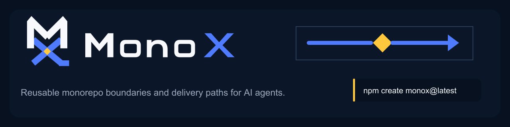

<p align="center">
  
</p>

# MonoX

[](https://www.npmjs.com/package/create-monox)
[](LICENSE)
[](package.json)

MonoX generates an agent-ready monorepo and its delivery contracts together. One command can create web, API
and worker workspaces, dependency boundaries, local services, CI, containers and a path to PM2, Coolify or
Kubernetes.

Every deployable package owns a versioned `package.json.deployment` block. The root config describes only
project boundaries, workload profiles, environments, targets and add-ons. There is no second application list
to keep in sync.

> `create-monox` 0.2.0 is the stable generator release and is published through the `latest` dist-tag. Stable
> support covers deterministic project generation and the source-tested offline contracts described below.
> Remote infrastructure execution remains guarded, acceptance-pending or plan-only as marked in the
> [capability status](docs/capability-status.md).

[Project site](https://monox.dev) | [Architecture](docs/architecture.md) |
[Deployment contract](docs/deployment.md) | [create-monox on npm](https://www.npmjs.com/package/create-monox)
| [Security gate](docs/security-gate.md)

## Generate a product

Create a project from the stable channel:

```bash
npm create monox@latest -- my-product \
  --workspace api=node-fastify-api \
  --workspace web=react-vite-web \
  --workspace jobs=node-worker \
  --addon redis \
  --addon rabbitmq \
  --delivery docker:local \
  --yes
```

From this source tree, use the same arguments with:

```bash
yarn create my-product \
  --workspace api=node-fastify-api \
  --workspace web=react-vite-web \
  --workspace jobs=node-worker \
  --addon redis \
  --addon rabbitmq \
  --delivery docker:local \
  --yes \
  --no-install
```

The result has explicit zones and a reproducible recipe lock:

```text
my-product/
├── apps/
│   ├── api/
│   ├── jobs/
│   └── web/
├── packages/
├── infra/
│   ├── docker/
│   └── local/
├── .github/workflows/ci.yml
├── AGENTS.md
├── monox.config.json
└── monox.lock
```

The generator refuses nonempty and symlink destinations. Bundled recipes are versioned and deterministic; it
does not clone a live repository. Unsupported combinations fail before project files are written.

## What MonoX wires for you

- workspace layout, package-manager configuration and dependency direction;
- package-level human and coding-agent boundaries;
- runtime health, readiness, liveness, logging and telemetry contracts;
- selected local services with no tracked default passwords;
- generated CI with immutable installs, tests and builds;
- non-root container defaults and typed Kubernetes resources;
- deployment plans bound to source, config, target state and adapter digests.

You still own product code, cloud accounts, domains, external secret values, budgets, capacity, data lifecycle
and production approvals. MonoX does not replace a cloud control plane or guarantee provider capacity.

## Deployment v2

A deployable workspace is discovered when its package manifest contains `deployment.enabled: true`:

```json
{
  "deployment": {
    "schemaVersion": "2",
    "enabled": true,
    "id": "jobs",
    "kind": "worker",
    "build": { "strategy": "dockerfile", "dockerfile": "Dockerfile" },
    "runtime": { "language": "typescript", "command": ["node", "dist/worker.js"] },
    "network": { "exposure": "none", "ports": [], "routes": [] },
    "env": {
      "values": { "LOG_LEVEL": "info" },
      "secretRefs": [{ "name": "rabbitmq-connection", "provider": "external-secrets" }]
    },
    "scaling": {
      "mode": "keda",
      "minReplicas": 0,
      "maxReplicas": 20,
      "metrics": [{ "type": "rabbitmq", "sourceRef": "rabbitmq", "queue": "jobs", "target": 10 }]
    }
  }
}
```

Unknown fields fail validation. Inline secret-like environment values are rejected. Environment and variant
patches use RFC 7396 merge-patch behavior, while `id`, `kind`, build strategy and runtime language stay
immutable. Every resolved base workload and variant must match exactly one target.

See [Deployment contract](docs/deployment.md) for the complete resolution order and safety rules.

## Source-tree delivery CLI

The delivery CLI below is tested from this repository with `yarn monox`. It is not installed by
`create-monox@0.2.0`; generated projects receive the deployment contracts and fail-closed placeholders only.
`@monox/cli` remains npm-private until its package scope and independent consumer contract are ready.

```text
yarn monox validate
yarn monox config explain <package> --env <environment> [--target <target>]
yarn monox doctor --env <environment> [--target <target>]
yarn monox plan --env <environment> --all|--select <ids>|--affected
yarn monox render --env <environment> --target <target> --all|--select <ids>|--affected --output-dir <dir>
yarn monox deploy --env <environment> --all|--select <ids>|--affected
yarn monox apply --plan <file>
yarn monox status --env <environment> --target <target>
yarn monox rollback --env <environment> --target <target> --revision <revision>
yarn monox destroy --env <environment> --target <target> --confirm <project/environment/target>
yarn monox cloud plan|setup|status|destroy --env <environment> --target <target>
yarn monox migrate deployment --from monox-v1|legacy-production --input <file>
```

An environment and one workload selector are mandatory for workload state changes. Production state changes
require `CI=true`, a protected environment and an identity reference. Destroy requires the exact
`project/environment/target` confirmation. A normal deploy cannot silently delete unmanaged resources.

## Maintained catalog

The stable generator contains 24 bundled workspace recipes:

- JavaScript and TypeScript: Node HTTP, Fastify, Express, Nest, Hono, workers, cron, React, Vue, Next, Nuxt,
  SvelteKit, Angular and TypeScript libraries.
- Python with `uv`: FastAPI, Django, workers, model services and libraries.
- PHP with Composer: Laravel API and libraries.
- Go: Chi API, workers and libraries.

Java, .NET and Rust remain extension recipes until they have maintained install, test, build and runtime CI.
Yarn, pnpm and npm are supported for JavaScript workspaces.

A scheduled 24-recipe matrix installs, tests, builds and starts or probes every built-in workspace. Release
candidates rerun that hosted matrix against the exact candidate commit.

The 28 add-on recipes cover data, messaging, AI, search, storage, identity, development, observability and
Kubernetes platform components. LocalStack and Mailpit are rejected for production. Stateful Kubernetes
add-ons are opt-in; production defaults to managed or external services.

## Delivery adapters

The source includes a built-in local Docker Compose executor, bundled PM2, Coolify and Kubernetes adapters
that require injected transports, an SSH transport primitive, and plan-only AWS and GCP providers. Adapter
methods are versioned through `Cloudapter`: `doctor`, `validate`, `plan`, `render`, `apply`, `status`,
`rollback` and `destroy`.

Local Docker Compose has a built-in executor that runs only allowlisted `docker compose` argument arrays with
`shell: false`, bounded readiness checks and explicit owned services. PM2, SSH, Coolify and Kubernetes retain
explicitly injected transports, so the CLI does not infer a host, credential or cluster context. AWS and GCP
are plan-only in 0.2.0; provider executors and live sandbox apply are not part of the stable support contract.

## Work on MonoX

Requirements: Node.js 22.22.2+, 24.15.0+, or 26.x. The reference repository uses Yarn 4.

```bash
npm install --global corepack@0.35.0
corepack enable
yarn install --immutable
yarn doctor
yarn check
```

Generate ignored local credentials before starting the Compose profile:

```bash
yarn local:env
docker compose --env-file infra/local/.env -f infra/local/docker-compose.yml --profile local up --build
```

`yarn check` covers formatting, repository boundaries, deployment resolution, tests, builds and infrastructure
validation. MonoX repository CI repeats the gate on Node.js 22, 24 and 26, tests Yarn, npm and pnpm consumers,
audits dependencies, scans the full history and creates an SPDX JSON source SBOM. Generated project CI is
limited to immutable install, lock verification, tests and builds. The 0.2 acceptance workflow also runs a
generated local Docker target through doctor, deploy, an explicit health probe, status and owned-only destroy.

## Clean-room boundary

MonoX began as a reusable monorepo and delivery foundation created and led by Moshe Harush. This public
implementation is clean-room: no private product history, customer source, account identifiers, live
manifests, domains or credentials are imported.

A private production reference currently has 42 tracked deployment contracts in its migration inventory. Only
generic behavior becomes synthetic fixtures. Its name and case study stay out of public claims until
credential cleanup, dual-render validation, a production canary and a proven rollback are complete.

Read [Provenance](PROVENANCE.md), [Security](SECURITY.md), [Contributing](CONTRIBUTING.md),
[Governance](GOVERNANCE.md) and [Support](SUPPORT.md).

Copyright 2026 Moshe Harush and MonoX contributors. MonoX is available under the [MIT License](LICENSE).
