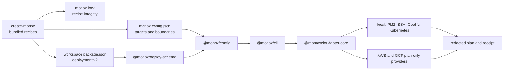

# MonoX 0.2 architecture

MonoX 0.2 is a source prerelease. The `0.2.0-alpha.1` tree implements the package-owned deployment contract,
deterministic generation, project resolution, offline planning and the first adapter boundaries. It is not a
claim that every advertised cloud path has completed a live apply.

## One source of truth per concern

| Concern                                   | Owner                                        | Must not be duplicated in  |
| ----------------------------------------- | -------------------------------------------- | -------------------------- |
| Workload build and runtime intent         | Runnable workspace `package.json.deployment` | Root application arrays    |
| Workspace globs and dependency boundaries | `monox.config.json`                          | Deployment adapters        |
| Environments and target selection         | `monox.config.json`                          | Package manifests          |
| Provider-neutral workload validation      | `@monox/deploy-schema`                       | Provider packages          |
| Resolution and unique target binding      | `@monox/config`                              | Renderers                  |
| State-change protocol                     | `@monox/cloudapter-core`                     | Generator recipes          |
| Generated recipe identity                 | `monox.lock`                                 | Live template repositories |

Every workspace with `deployment.enabled: true` is discovered as a deployable app. Libraries omit the
deployment block. Root configuration has no `applications[]` field.

## Resolution pipeline

The resolver produces one immutable workload wrapper for every base workload and enabled variant. It applies
configuration in this order:

1. secure built-in defaults;
2. root workload profile;
3. package base deployment;
4. package environment patch;
5. variant patch;
6. variant environment patch;
7. target-derived bindings.

Environment and variant patches follow RFC 7396. Objects merge recursively, arrays replace in full, and `null`
removes an optional property. A patch cannot change the workload `id`, `kind`, build strategy or runtime
language.

Each resolved workload must match exactly one environment binding. Zero target matches and multiple target
matches are validation errors, before rendering or external state inspection.

## Root target model

A target uses four independent axes:

| Axis        | Values in schema v2                                                   |
| ----------- | --------------------------------------------------------------------- |
| Provider    | `generic`, `aws`, `gcp`                                               |
| Provisioner | `none`, `pulumi`                                                      |
| Transport   | `local`, `ssh`, `aws-ssm`, `gcp-iap`, `coolify-api`, `kubernetes-api` |
| Runtime     | `pm2`, `docker`, `coolify`, `kubernetes`, `static`                    |

Bindings may name a namespace, registry, domain, identity reference or external secret-store reference. They
must not contain credentials. The current AWS and Google Cloud packages emit deterministic Pulumi intent only.
They do not run Pulumi or contact a provider in `0.2.0-alpha.1`.

## Package map



The public source tree contains these package groups:

- Core: config discovery and resolution, workspace discovery, affected calculation, development runner and
  agent guidance compilation.
- Runtime: app lifecycle, structured logging, telemetry primitives, service discovery, Fastify integration and
  test utilities.
- Delivery: deployment schemas, Kubernetes rendering, the Cloudapter contract, delivery adapters and provider
  intent packages.
- Bootstrap: `create-monox`, the only package approved for public npm publication during the alpha sequence.

The remaining packages are public source but stay npm-private until the `@monox` scope ownership and release
policy are verified.

## Recipe contracts

Bundled workspace and add-on recipes have a catalog version, recipe version and SHA-256 integrity. The
generator writes the selected IDs, versions and integrity values to `monox.lock`, including a digest over the
complete resolved selection. It never clones a live repository.

`create-monox` publishes the versioned `WorkspaceRecipe` and `AddonRecipe` TypeScript data contracts for
catalog inspection and tooling. Loading third-party recipes is not enabled in `0.2.0-alpha.1`; generation is
still restricted to recipes bundled with the package. A future external reference must use a namespaced ID,
declare its API and recipe versions, and carry a verified integrity record before MonoX can accept it.

## Cloudapter state boundary

`Cloudapter` is a versioned interface with:

```text
doctor -> validate -> plan -> render -> apply -> status -> rollback -> destroy
```

Plans and receipts use canonical, redacted content digests. A plan binds the adapter identity, Git HEAD when
available, tracked and non-ignored working-tree bytes, resolved configuration, target state, environment,
target and workload set. Apply rescans source and rejects a plan when any bound digest is stale. Ignored
`.monox/` state and the plan file being applied are excluded. Timestamps are audit metadata and do not change
content identity.

The local Docker adapter uses a built-in executor with fixed argument arrays, `shell: false` and explicit
service ownership. Remote execution-capable adapters accept injected transports. They do not infer a kube
context, read an SSH key, or construct a shell string from configuration. AWS and GCP adapters are
deliberately plan-only in this alpha.

## Runtime contract

Runtime packages give services and workers reusable behavior without importing business code:

- structured logs with recursive credential-field redaction;
- health, readiness and liveness state;
- request IDs and Prometheus-compatible metrics;
- graceful drain with bounded shutdown time;
- explicit service endpoints with no hidden company domains.

Applications may depend on packages. Packages never depend on applications. Infrastructure may consume schemas
and renderers, but it does not import app source.

## Clean-room boundary

MonoX uses private production systems only as behavioural references. Product code, Git history, account IDs,
customer data, production domains, live manifests and credentials do not enter this repository. Migration
fixtures use synthetic names and reserved domains.

The current private reference inventory contains 42 tracked deployment blocks. That count is input to a
read-only migration report, not evidence of a public case study or completed production rollout. A case study
can be published only after credential cleanup, reviewed diffs, a canary and a proven rollback.

Architecture decisions and their safety rationale are recorded in the [decision log](adr/README.md). Current
implementation status is tracked in [capability-status.md](capability-status.md).
